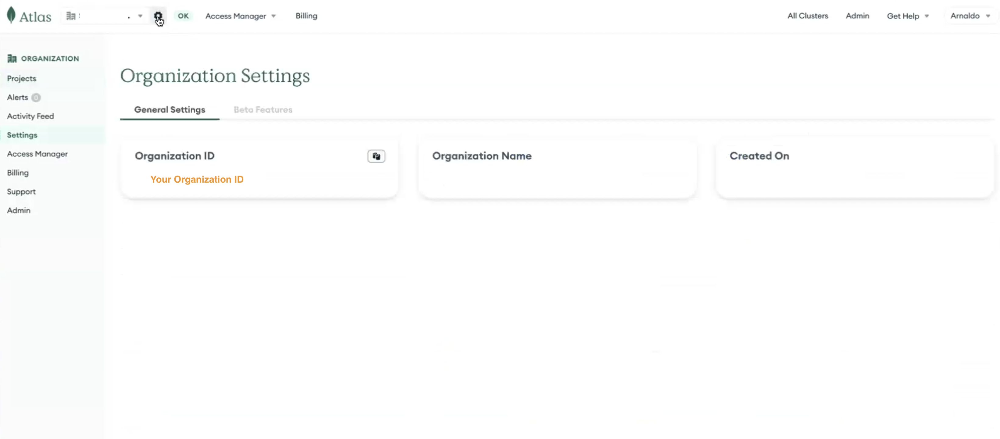
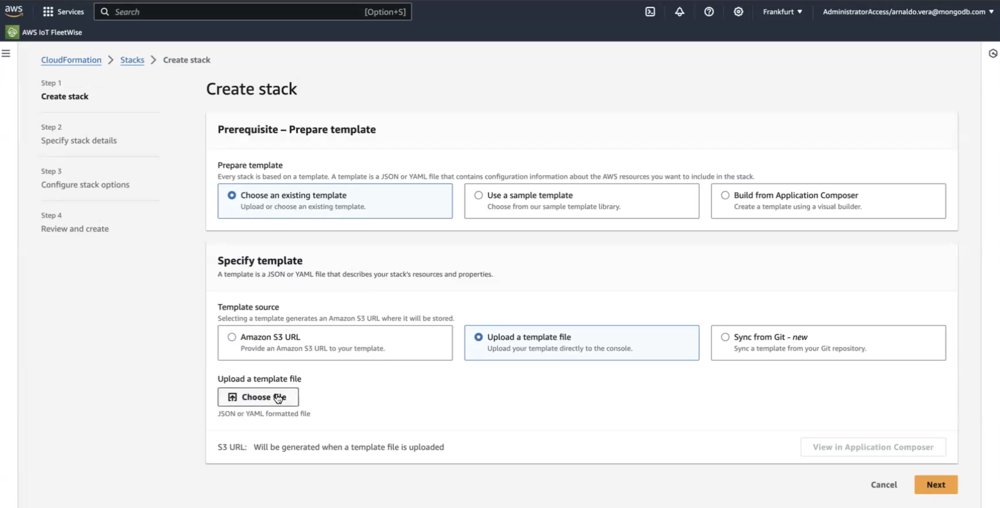
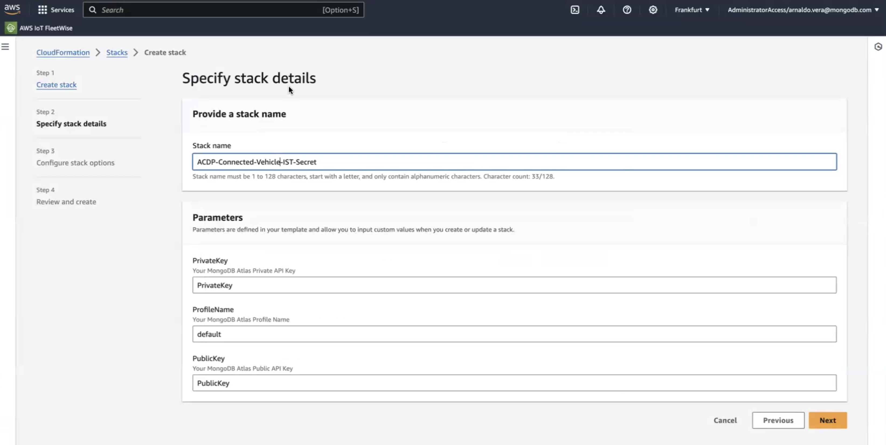
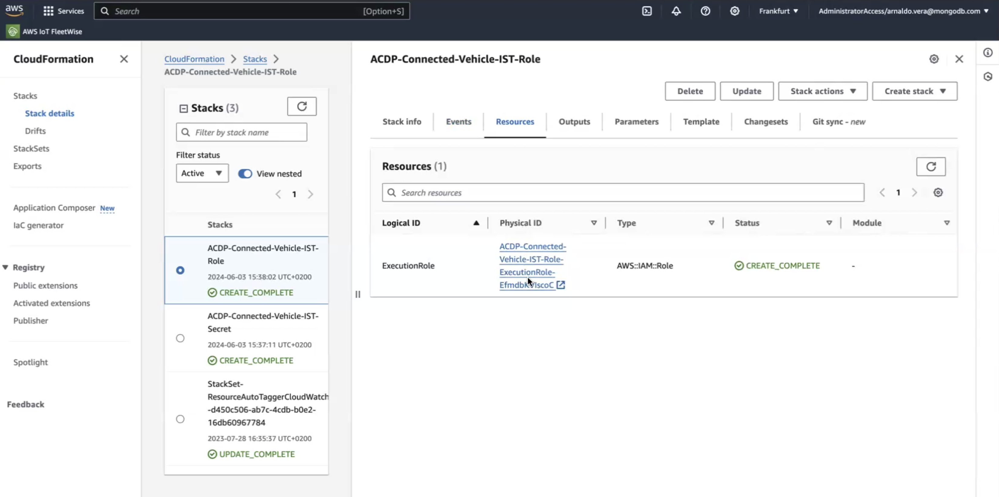
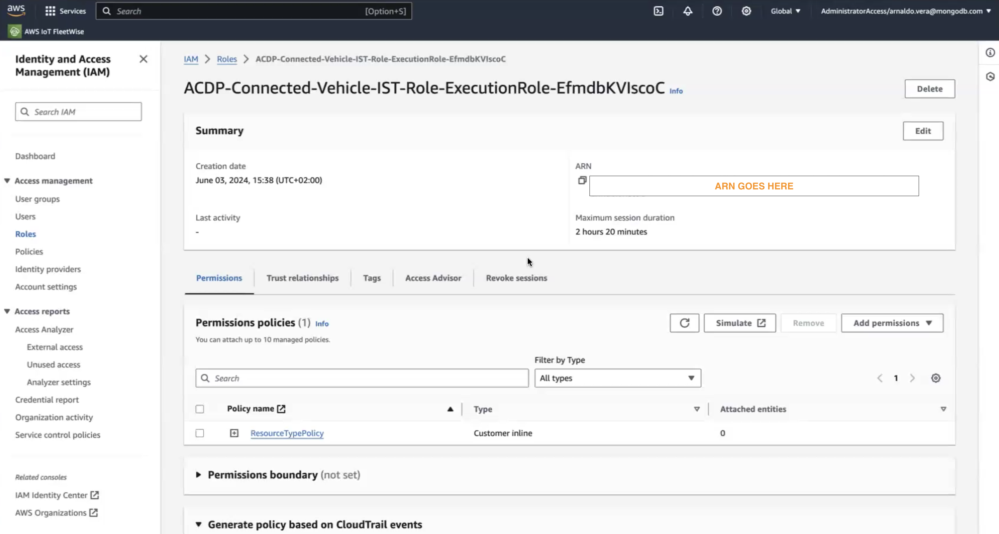
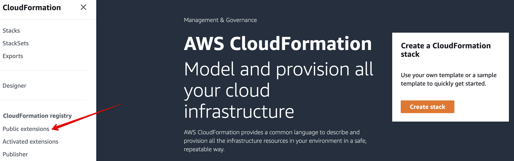

# Setup Instructions for AWS CMS ACDP

In order to spin up this demo on the AWS CMS Automotive Cloud Developer Portal, there are some preparation steps we have to do so our AWS and MongoDB environments are correctly setup. 

In this section we are going to go step by step on how to create all the necessary secrets, permissions and services so that the demo can run on the AWS Cloud Mobility Solutions automatically. 


## Set up MongoDB Atlas API Key Access

1. Go to Organization Settings in your Atlas environment by clicking on the gear icon next to your organization name, as you can see in the image.



2. [Create an API Key in your organization](https://www.mongodb.com/docs/atlas/configure-api-access/#create-an-api-key-in-an-organization) by following the instructions in the link. 
3. Once finished, keep the Public and Private keys, as we will need them in the next step

##  Set up AWS CloudFormation resources
1. Install and configure an [AWS Account + AWS CLI](https://docs.aws.amazon.com/cli/latest/userguide/getting-started-install.html)

### Create Profile Secrets Stack


1. On your AWS Dashboard, go to the Cloudformation service. On the left-side panel, click on Stacks. Then go to ***Create Stack*** --> ***With new resources (standard)***, as you can see on the image below:


2. In the new page, select ***Choose an existing template*** in the *Prerequisite - Prepare template* section. Below specify ***Upload a template file*** and choose the file located in `cdk/CloudFormation-stack-templates/profile-secret.yml`. This will use the `profile-secret.yml` file template for the creation of the stack.

 

3.  Go to the next step, you will be required to give a Stack Name. Since this is the Secret Stack, we recommend setting it after this. Then you will need to set the Private and Public Key from your MongoDB Atlas Organization that we got in the previous section of this document.  

 

4. After this, keep going through the steps until the end. The default configurations are fine. 

Now your Secret Stack will be created!


### Create Execution Role Stack


1. On your AWS Dashboard, go to the Cloudformation service. On the left-side panel, click on Stacks. Then go to ***Create Stack*** --> ***With new resources (standard)***, as you can see on the image below:


2. In the new page, select ***Choose an existing template*** in the *Prerequisite - Prepare template* section. Below specify ***Upload a template file*** and choose the file located in `cdk/CloudFormation-stack-templates/execution-role.yml`. This will use the `execution-role.yml` file template for the creation of the stack.

 

3.  Go to the next step, you will be required to give a Stack Name. Because the template we gave before doesn't require any parameters, we can continue.

4. After this, keep going through the steps until the end. The default configurations are fine. 

Now your Execution Role Stack will be created!


### Retrieve Execution Role ARN

1. In Cloudformation, go the ***Resources*** tab, and click on the Physical ID. This will open a new window, that will take you to IAM:



2. In this new page, copy the ARN located in the ***Summary*** section:




Keep this ARN, as we will use it several times in the next step


### Activate Cloudformation Public Extensions

1. In Cloudformation, on the left-side panel, click on Public Extensions.


2. In the Filter menu under Publisher, choose Third party, and search for these 4 custom public resources: 

- MongoDB::Atlas::Project
- MongoDB::Atlas::Cluster
- MongoDB::Atlas::DatabaseUser
- MongoDB::Atlas::ProjectIpAccessList


3. We will need to activate the each of the 4 CloudFormation resources above. Search for one, click on it, and then select ***Active***. 

4. In the ***Execution role ARN*** field, paste the ARN we retrieved on the previous step. 

5. Then finalize by selecting ***Activate Extension***.

6. Do this for the 4 resources listed above. 


### Set up Environment Variables file

Go to the .env file located in: `cdk/cms-cdk/parameters/.env`, it should look something like this:

```json
export AWS_ACCESS_KEY_ID="xxxx" // AWS Account Access Key 
export AWS_SECRET_ACCESS_KEY="xxxx" // AWS Account Secret Access Key
export AWS_SESSION_TOKEN="xxxx" // AWS Account Session Token
export ORG_ID="xxxx" // MongoDB Atlas Organization ID
export MONGODB_USER="xxxx" // Set a Username of your choice here
export MONGODB_PASSWORD="xxxx" // Set a Password of your choice here
export ATLAS_PUBLIC_KEY="xxxx" // MongoDB Atlas Organization Public Key
export ATLAS_PRIVATE_KEY="xxxx" // MongoDB Atlas Organization Private Key
export ATLAS_APP_NAME="xxxx" // MongoDB App Services App ID
export AWS_ACCOUNT_ID="xxxx" // Your AWS Account ID
export AWS_REGION="xxxx" // AWS region of your choice
export ATLAS_APP_PWD="xxxx" // MongoDB App Services App Password
export ATLAS_APP_USER="xxxx" // MongoDB App Services App Username
export MODEL_ENDPOINT="xxxx"
export PYTHON_VERSION="xxxx" // Set PYTHON_3_12
```
Fill all the fields with your secrets and environment variables. 

You are done now with the pre-requisites!!